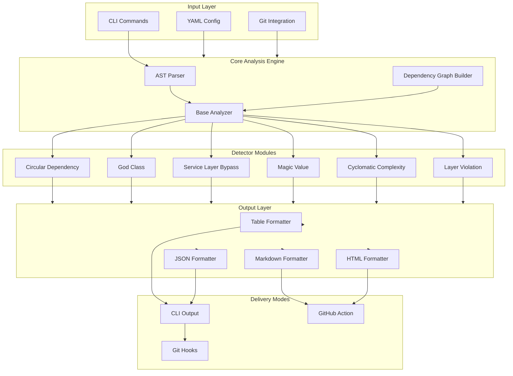

# ArchGuard 🛡️

> Made Autonomously Using **NEO** — Your Autonomous AI Engineering Agent
> [https://heyneo.com](https://heyneo.com)

[](https://marketplace.visualstudio.com/items?itemName=NeoResearchInc.heyneo)
[](https://marketplace.cursorapi.com/items/?itemName=NeoResearchInc.heyneo)


**AI Code Architecture Drift Detector**

ArchGuard is a production-ready Python tool that detects architecture degradation patterns in codebases over time. It performs static analysis to identify code smells, architectural violations, and complexity issues before they become technical debt.

[](https://www.python.org/downloads/)
[](LICENSE)
[](https://github.com/astral-sh/ruff)

## Features

- 🔍 **6 Built-in Detectors**: Circular dependencies, God classes, service layer bypasses, magic values, cyclomatic complexity, layer violations
- 📊 **Per-PR Analysis**: Compare architecture health between branches
- 📈 **Trend Analysis**: Track architecture health over the last 10 commits
- 🖥️ **Multiple Output Formats**: Table, JSON, YAML, Markdown, HTML
- 🔧 **CLI & Git Hooks**: Command-line tool with pre-commit and pre-push hooks
- 🚀 **GitHub Action**: CI/CD integration for automated architecture checks
- ⚙️ **YAML Configuration**: Flexible, project-specific configuration

## Architecture



## Installation

### From PyPI (when published)

```bash
pip install archguard
```

### From Source

```bash
git clone https://github.com/archguard/archguard.git
cd archguard
pip install -e ".[dev]"
```

## Quick Start

### 1. Initialize Configuration

```bash
archguard init
```

This creates a `.archguard.yml` configuration file in your project root.

### 2. Run Analysis

```bash
# Scan current directory
archguard scan

# Scan specific path
archguard scan ./src

# Output as JSON
archguard scan --format json --output report.json

# Filter by severity
archguard scan --severity high
```

### 3. View Trends

```bash
# Analyze trends over last 10 commits
archguard trend

# Custom number of commits
archguard trend --commits 20
```

## CLI Commands

### `scan` - Analyze Codebase

```bash
archguard scan [PATH] [OPTIONS]

Options:
  -f, --format [table|json|yaml|markdown|html]  Output format
  -o, --output PATH                             Output file path
  -d, --detectors TEXT                           Specific detectors to run
  -s, --severity [critical|high|medium|low|info] Minimum severity
  --fail-on-violations                          Exit with error if violations found

Global options (before subcommand):
  -c, --config PATH                             Path to configuration file
  -v, --verbose                                 Enable verbose output
```

### `trend` - Analyze Trends

```bash
archguard trend [OPTIONS]

Options:
  -n, --commits INTEGER  Number of commits to analyze (default: 10)
  -f, --format TEXT      Output format
  -o, --output PATH      Output file path
```

### `init` - Create Configuration

```bash
archguard init [OPTIONS]

Options:
  -p, --path PATH  Config file path (default: .archguard.yml)
```

### `config` - Manage Configuration

```bash
# Show all config
archguard config

# Get specific value
archguard config output_format

# Set value
archguard config output_format json
```

## Configuration

Create a `.archguard.yml` file in your project root:

```yaml
project_name: "My Project"
project_root: "."

# File patterns
include_patterns:
  - "**/*.py"

exclude_patterns:
  - "**/tests/**"
  - "**/__pycache__/**"
  - "**/venv/**"

include_tests: false

# Detector configurations
detectors:
  circular_dependency:
    enabled: true
    severity: high
    options:
      min_cycle_length: 2
      max_cycles: 100

  god_class:
    enabled: true
    severity: medium
    options:
      max_methods: 20
      max_attributes: 15
      max_lines: 500

  service_layer_bypass:
    enabled: true
    severity: high

  magic_value:
    enabled: true
    severity: low
    options:
      min_string_length: 3

  cyclomatic_complexity:
    enabled: true
    severity: medium
    options:
      thresholds:
        low: 10
        medium: 20
        high: 30
        critical: 50

  layer_violation:
    enabled: true
    severity: high

# Output settings
output_format: table
fail_on_violations: false
severity_threshold: low

# Git settings
git_enabled: true
compare_branch: main
max_commits: 10

# Trend analysis
trend_enabled: true
trend_history_limit: 10
```

## Detectors

### Circular Dependency

Detects circular import dependencies between modules.

```python
# Bad: module_a.py imports module_b.py, which imports module_a.py
from module_b import func_b

def func_a():
    return func_b()
```

**Configuration:**
- `min_cycle_length`: Minimum cycle length to report (default: 2)
- `max_cycles`: Maximum cycles to report (default: 100)

### God Class

Detects classes with too many methods, attributes, or lines.

**Configuration:**
- `max_methods`: Maximum methods per class (default: 20)
- `max_attributes`: Maximum attributes per class (default: 15)
- `max_lines`: Maximum lines per class (default: 500)

### Service Layer Bypass

Detects when controller/presentation layers bypass service layers to access repositories directly.

**Configuration:**
- `controller_patterns`: Regex patterns for controller files
- `service_patterns`: Regex patterns for service files
- `repository_patterns`: Regex patterns for repository files

### Magic Value

Detects hardcoded literals that should be named constants.

**Configuration:**
- `min_string_length`: Minimum string length to flag (default: 3)
- `max_string_length`: Maximum string length to check (default: 100)

### Cyclomatic Complexity

Detects functions/methods with high cyclomatic complexity.

**Configuration:**
- `thresholds`: Complexity thresholds for each severity level

### Layer Violation

Detects violations of layered architecture (e.g., presentation layer importing from repository).

**Configuration:**
- `layers`: Layer definitions with patterns and allowed calls

## Git Hooks

### Installation

```bash
# Install pre-commit hook
python hooks/install.py

# Install both hooks
python hooks/install.py --pre-commit --pre-push

# Force overwrite existing hooks
python hooks/install.py --force

# Uninstall hooks
python hooks/install.py --uninstall
```

### Pre-commit Hook

Runs ArchGuard on staged Python files before committing.

### Pre-push Hook

Runs trend analysis before pushing to remote.

## GitHub Action

### Basic Usage

```yaml
name: ArchGuard Check

on: [push, pull_request]

jobs:
  architecture-check:
    runs-on: ubuntu-latest
    steps:
      - uses: actions/checkout@v4
        with:
          fetch-depth: 0

      - uses: archguard/archguard-action@v1
        with:
          path: '.'
          format: 'table'
          severity: 'medium'
          fail-on-violations: 'false'
```

### Advanced Configuration

```yaml
name: ArchGuard Analysis

on:
  pull_request:
    branches: [main]

jobs:
  analyze:
    runs-on: ubuntu-latest
    steps:
      - uses: actions/checkout@v4
        with:
          fetch-depth: 0

      - uses: archguard/archguard-action@v1
        with:
          path: '.'
          format: 'markdown'
          severity: 'low'
          enable-trend: 'true'
          trend-commits: '10'

      - uses: actions/upload-artifact@v4
        with:
          name: architecture-report
          path: archguard-report.md
```

## Development

### Setup

```bash
# Clone repository
git clone https://github.com/archguard/archguard.git
cd archguard

# Create virtual environment
python -m venv venv
source venv/bin/activate  # On Windows: venv\Scripts\activate

# Install dependencies
pip install -e ".[dev]"

# Install pre-commit hooks
pre-commit install
```

### Running Tests

```bash
# Run all tests
pytest

# Run with coverage
pytest --cov=src/archguard --cov-report=html

# Run specific test file
pytest tests/unit/test_detectors.py

# Run integration tests
pytest tests/integration/
```

### Code Quality

```bash
# Run linter
ruff check src/ tests/
ruff check --fix src/ tests/

# Run type checker
pyright src/

# Run all checks
ruff check src/ tests/ && pyright src/
```

## Project Structure

```
archguard/
├── src/archguard/           # Main source code
│   ├── analyzers/           # AST analysis framework
│   ├── detectors/           # Architecture detectors
│   ├── formatters/          # Output formatters
│   ├── git/                 # Git integration
│   ├── config/              # Configuration system
│   ├── cli.py               # Command-line interface
│   └── types.py             # Type definitions
├── tests/                   # Test suite
│   ├── unit/                # Unit tests
│   └── integration/         # Integration tests
├── hooks/                   # Git hooks
│   ├── pre-commit           # Pre-commit hook
│   ├── pre-push             # Pre-push hook
│   └── install.py           # Hook installer
├── github-action/           # GitHub Action
│   ├── action.yml           # Action definition
│   └── example-workflow.yml # Example workflow
├── docs/                    # Documentation
├── examples/                # Example configurations
├── pyproject.toml           # Project configuration
├── ruff.toml                # Ruff configuration
└── README.md                # This file
```

## Contributing

1. Fork the repository
2. Create a feature branch (`git checkout -b feature/amazing-feature`)
3. Make your changes
4. Run tests (`pytest`)
5. Run linting (`ruff check src/ tests/`)
6. Commit your changes (`git commit -m 'Add amazing feature'`)
7. Push to the branch (`git push origin feature/amazing-feature`)
8. Open a Pull Request

## License

This project is licensed under the MIT License - see the [LICENSE](LICENSE) file for details.

## Acknowledgments

- Built with [Click](https://click.palletsprojects.com/) for CLI
- AST parsing with Python's built-in `ast` module
- Dependency graph analysis with [NetworkX](https://networkx.org/)
- Rich terminal output with [Rich](https://rich.readthedocs.io/)
- Git integration with [GitPython](https://gitpython.readthedocs.io/)

## Support

- 📖 [Documentation](https://archguard.readthedocs.io/)
- 🐛 [Issue Tracker](https://github.com/archguard/archguard/issues)
- 💬 [Discussions](https://github.com/archguard/archguard/discussions)

---

**ArchGuard** - Protecting your architecture, one commit at a time. 🛡️

## Project Overview

ArchGuard is a static-analysis architecture drift detector that flags structural regressions (cycles, god classes, layer violations, and complexity issues) over time. It targets teams using PR checks and pre-push controls for maintainability.

## Prerequisites

- Python 3.10+
- `pip`
- Git repository context for trend and diff workflows

## API Reference

CLI-first tool; no network API is required. Primary commands are `archguard scan`, `archguard trend`, `archguard init`, and `archguard config`.

## Models Used

No AI model dependency is required. ArchGuard uses deterministic local static analysis.

## Testing

```bash
ruff check src/ tests/
pyright src/
pytest
```
