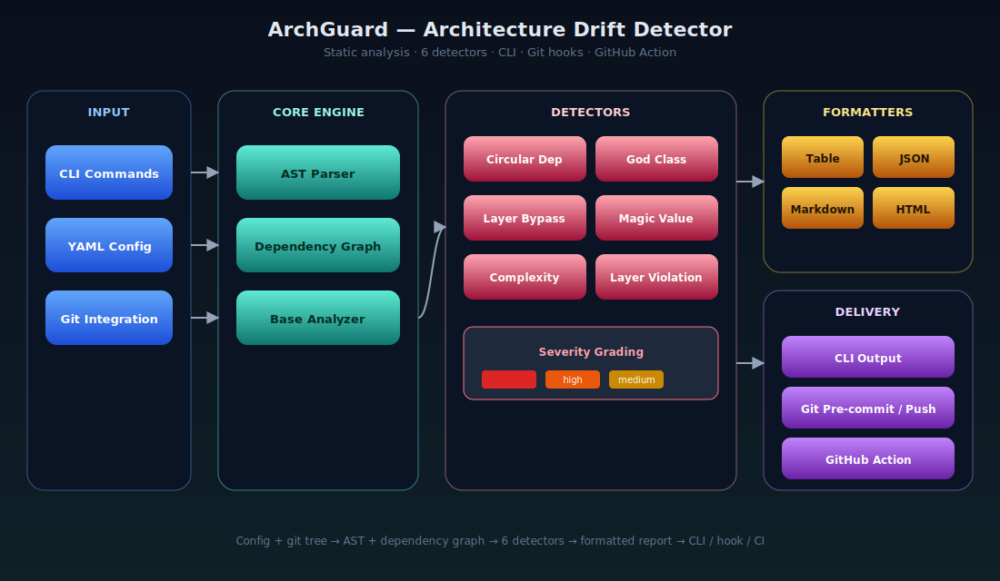

# ArchGuard 🛡️

> Made Autonomously Using **NEO** — Your Autonomous AI Engineering Agent
> [https://heyneo.com](https://heyneo.com)

**AI Code Architecture Drift Detector**

ArchGuard is a production-ready Python tool that detects architecture degradation patterns in codebases over time. It performs static analysis to identify code smells, architectural violations, and complexity issues before they become technical debt.

## Features

- 🔍 **6 Built-in Detectors**: Circular dependencies, God classes, service layer bypasses, magic values, cyclomatic complexity, layer violations
- 📊 **Per-PR Analysis**: Compare architecture health between branches
- 📈 **Trend Analysis**: Track architecture health over the last 10 commits
- 🖥️ **Multiple Output Formats**: Table, JSON, YAML, Markdown, HTML
- 🔧 **CLI & Git Hooks**: Command-line tool with pre-commit and pre-push hooks
- 🚀 **GitHub Action**: CI/CD integration for automated architecture checks
- ⚙️ **YAML Configuration**: Flexible, project-specific configuration

## Architecture

  

The CLI and YAML config feed the core engine (AST parser + dependency graph + base analyzer), which fans out to six detectors. Findings are graded by severity, rendered as Table / JSON / Markdown / HTML, and delivered through the CLI, git hooks, or the GitHub Action.

## Installation

### From PyPI (when published)

Install with `pip install archguard`.

### From Source

Clone the repository, change into it, and run `pip install -e ".[dev]"`.

## Quick Start

1. Run `archguard init` to create `.archguard.yml` in the project root.
2. Run `archguard scan` to analyze the current tree, or point it at a path such as `archguard scan ./src`.
3. Use `--format json --output report.json` when you want machine-readable results.
4. Run `archguard trend` to review recent architecture drift over the last 10 commits.

## CLI Commands

### `scan` - Analyze Codebase

Use `archguard scan [PATH] [OPTIONS]`. Key flags are `--format`, `--output`, `--detectors`, `--severity`, and `--fail-on-violations`; global flags include `--config` and `--verbose`.

### `trend` - Analyze Trends

Use `archguard trend [OPTIONS]` with `--commits`, `--format`, and `--output`.

### `init` - Create Configuration

Use `archguard init [OPTIONS]`; `--path` selects the config file location.

### `config` - Manage Configuration

`archguard config` shows the active configuration, while `archguard config output_format` reads a value and `archguard config output_format json` updates it.

## Configuration

Create a `.archguard.yml` file in your project root:
The config supports project metadata, include/exclude patterns, and per-detector options such as cycle length, maximum class size, and complexity thresholds. Output behavior, Git integration, and trend analysis are all controlled through the same file with simple key-value settings.

## Detectors

### Circular Dependency

Detects circular import dependencies between modules.

**Configuration:**
- `min_cycle_length`: Minimum cycle length to report (default: 2)
- `max_cycles`: Maximum cycles to report (default: 100)

### God Class

Detects classes with too many methods, attributes, or lines.

**Configuration:**
- `max_methods`: Maximum methods per class (default: 20)
- `max_attributes`: Maximum attributes per class (default: 15)
- `max_lines`: Maximum lines per class (default: 500)

### Service Layer Bypass

Detects when controller/presentation layers bypass service layers to access repositories directly.

**Configuration:**
- `controller_patterns`: Regex patterns for controller files
- `service_patterns`: Regex patterns for service files
- `repository_patterns`: Regex patterns for repository files

### Magic Value

Detects hardcoded literals that should be named constants.

**Configuration:**
- `min_string_length`: Minimum string length to flag (default: 3)
- `max_string_length`: Maximum string length to check (default: 100)

### Cyclomatic Complexity

Detects functions/methods with high cyclomatic complexity.

**Configuration:**
- `thresholds`: Complexity thresholds for each severity level

### Layer Violation

Detects violations of layered architecture (e.g., presentation layer importing from repository).

**Configuration:**
- `layers`: Layer definitions with patterns and allowed calls

## Git Hooks

### Installation

Use `python hooks/install.py` to install the pre-commit hook, add `--pre-commit --pre-push` to install both hooks, use `--force` to overwrite existing hooks, and `--uninstall` to remove them.

### Pre-commit Hook

Runs ArchGuard on staged Python files before committing.

### Pre-push Hook

Runs trend analysis before pushing to remote.

## GitHub Action

### Basic Usage

Use the ArchGuard GitHub Action on push or pull request workflows, check out the repository with full history, and pass the path, format, severity, and fail-on-violations settings as action inputs.

### Advanced Configuration

For deeper analysis, enable trend mode, select Markdown output, set the commit window, and upload the generated report as an artifact.

## Development

### Setup

Clone the repository, create and activate a virtual environment, install `.[dev]`, and then run `pre-commit install`.

### Running Tests

Run `pytest` for the full suite, `pytest --cov=src/archguard --cov-report=html` for coverage, `pytest tests/unit/test_detectors.py` for a targeted detector check, and `pytest tests/integration/` for integration coverage.

### Code Quality

Use `ruff check src/ tests/` for linting, `ruff check --fix src/ tests/` for auto-fixes, `pyright src/` for type checking, and `ruff check src/ tests/ && pyright src/` for the combined gate.

## Project Structure

Core layout: `src/archguard/` contains analyzers, detectors, formatters, Git integration, configuration, the CLI, and type definitions; `tests/` holds unit and integration coverage; `hooks/` contains Git hook scripts and the installer; `github-action/` stores the action definition and example workflow; `docs/` and `examples/` provide supporting material; and `pyproject.toml` plus `ruff.toml` define tooling.

## Contributing

1. Fork the repository
2. Create a feature branch (`git checkout -b feature/amazing-feature`)
3. Make your changes
4. Run tests (`pytest`)
5. Run linting (`ruff check src/ tests/`)
6. Commit your changes (`git commit -m 'Add amazing feature'`)
7. Push to the branch (`git push origin feature/amazing-feature`)
8. Open a Pull Request

## License

This project is licensed under the MIT License - see the [LICENSE](LICENSE) file for details.

## Acknowledgments

- Built with [Click](https://click.palletsprojects.com/) for CLI
- AST parsing with Python's built-in `ast` module
- Dependency graph analysis with [NetworkX](https://networkx.org/)
- Rich terminal output with [Rich](https://rich.readthedocs.io/)
- Git integration with [GitPython](https://gitpython.readthedocs.io/)

## Support

- 📖 [Documentation](https://archguard.readthedocs.io/)
- 🐛 [Issue Tracker](https://github.com/archguard/archguard/issues)
- 💬 [Discussions](https://github.com/archguard/archguard/discussions)

---

**ArchGuard** - Protecting your architecture, one commit at a time. 🛡️

## Project Overview

ArchGuard is a static-analysis architecture drift detector that flags structural regressions (cycles, god classes, layer violations, and complexity issues) over time. It targets teams using PR checks and pre-push controls for maintainability.

## Prerequisites

- Python 3.10+
- `pip`
- Git repository context for trend and diff workflows

## API Reference

CLI-first tool; no network API is required. Primary commands are `archguard scan`, `archguard trend`, `archguard init`, and `archguard config`.

## Models Used

No AI model dependency is required. ArchGuard uses deterministic local static analysis.

## Testing

Run `ruff check src/ tests/`, `pyright src/`, and `pytest`.
